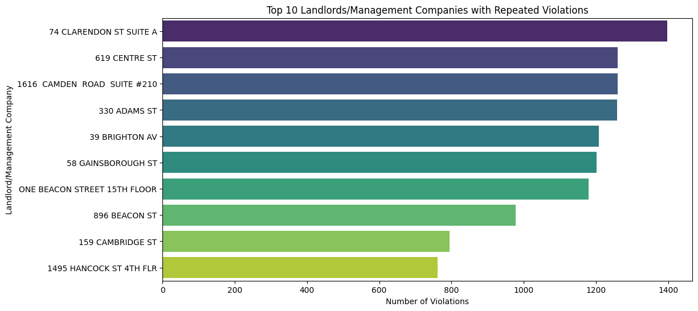
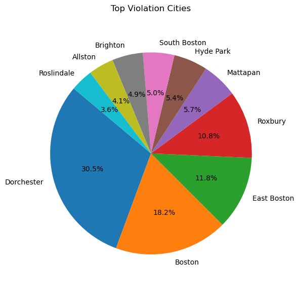
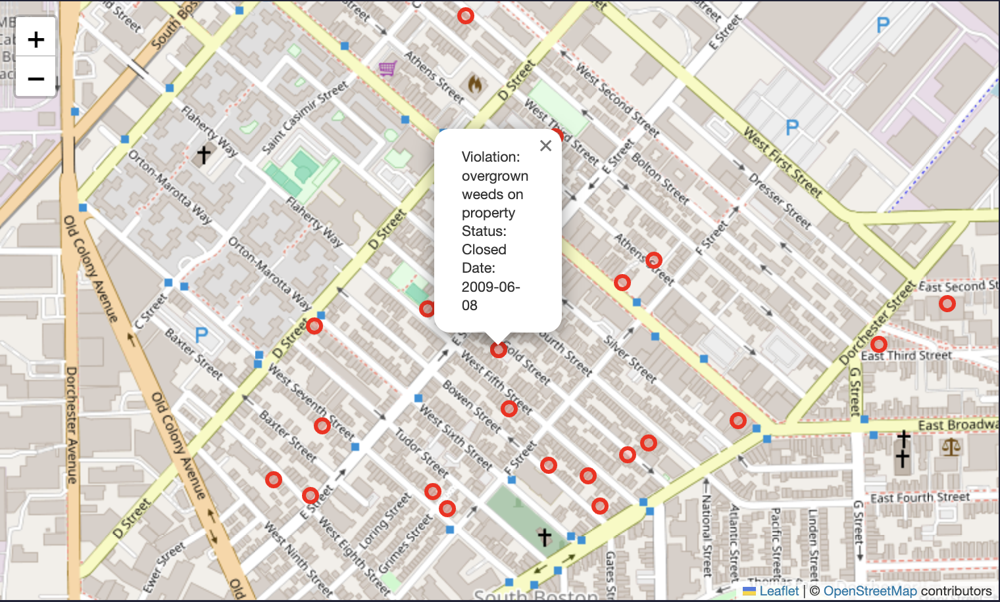

# Data-Science-Project

## Boston Housing Violations Analysis
### Description
The project's aim is to analyze different violations around the city of Boston and identify systemic issues and trends.
Using violation records from the given datasets, we aim to provide actionable insights to improve housing quality.

### Dataset(s)

- [Public Works Violations Dataset](https://data.boston.gov/dataset/public-works-violations)
- [Building and Property Violations Dataset](https://data.boston.gov/dataset/building-and-property-violations1)
- [Property Assessment Dataset](https://data.boston.gov/dataset/property-assessment)
- [Live Street Address Management Dataset](https://data.boston.gov/dataset/live-street-address-management-sam-addresses)

### Project Blueprint: Making Sense of the Notebooks

* The 'Public Works Violations' dataset can be cleaned using PWV_Cleaning.ipynb notebook. This will generate a processed file named PWV_processed.csv.

* The generated PWV_processed.csv file should be loaded to TDS_Midterm_Clustering_EDA_6.ipynb to replicate our analysis and find answers to key questions discussed in "Insights" section. 

* The location plots can be created for visualization by running DS_Midterm_Clustering_EDA_6.ipynb and boston_violations_map.ipynb files with the same processed data.

* Download the 'Building and Property Violations' dataset and run it through the Property_Violations.ipynb notebook to obtain a preprocessed dataset and draw insights of data distribution.

* Our baseline model results can be reproduced using the init_pred_modelling.ipynb file.

### Data preprocessing
We performed data cleaning and preprocessing for three different datasets corresponding to different analytical objectives.

1. Building and Property Violations

    * We first check for null values and dropped the columns, 'value', 'violation_sthigh' and 'contact_addr2' as they had more than 70 percent null values.

    * Next, we then imputed 'description''s null values with 'Unknwown'.The description in this dataset contains the information about the type of violations We did not drop these as it was an important attribute and wanted to retain as much information as possible. We retained around 50% of the rows with null values by doing this.

    * We dropped the rest of the rows, around 300 out of 16591, which had null values. 

    * We then removed the duplicate rows. These were 16 rows.
    
    * We dropped status_dttm (information about the time of violation) and location(redundant information)
    
    * We also binary encoded status.

2. Public Works Violations Dataset
    * This is almost the same exact procedure as above. These two datasets have almost similar columns, with different values. 

    * We first dropped the attributes ('violation_sthigh', 'contact_addr2', 'violation_state', 'contact_zip', 'contact_state', 'contact_city', 'violation_suffix', 'ticket_no'). Out of these some had a considerable amount of null values while the rest seemed redundant at this moment.

    * The 'description' and 'code' had sub classes, so we clubbed them into a single one to make it simpler.

            Before:
            10a -> ['Illegal dumping park']
        
            10b -> ['Illegal dumping 1-5 cuyd.']
        
            10c -> ['Illegal dumping 5 cubic yd.']

            After:
            
            10 -> ['Illegal dumping']
    
3. Public Assessment Dataset

    * Here, we wanted to see if we can use the building details available to train a classifier to predict for a violation.

    * So we first concatenated the Public Works Violation Dataset to Property Assessment Dataset. The Public Works Violation and Street Address Management Dataset have a common attribute 'sam_id' == 'SAM_ADDRESS_ID'. Street Address Management dataset and Property Assessment Dataset have a common attribute ('PARCEL' == 'PID'). So based on this connection we added new attribute to Property Assessment Dataset, 'violation_bool' which is 1 if the corresponding 'PID' has a violation recorded, else 0.

    * We then did the usual data cleaning. We dropped attributes with a considerable amount of null values. We also then dropped the location based attributes, because our experiments on location didnt provide us with any insights (discussed in the next section).

    * We then imputed values for 'FULL_BTH', 'HLF_BTH', 'KITCHENS', 'FIREPLACES', as they seemed important for predicting violations, and then dropped the remaining null value rows.  

### Current Insights

1. We tried plotting the violations to their locations to see if we can get any insights about a particular area having an increased number of violations of a particular category. This didn't give us the results we hoped we would get.

It just looked like all violations take place in all the places. When plotted together, trash related violations dominate the whole map as there are in a majority. When tried plotting separately, they were either too sparse or too dense.

2. We then tried to answer a couple of questions regarding the Public Works Violations dataset:
    
    * Q: Which address has the most repeated violations? A: 74 Clarendon ST Suite A
        

    * Q: Which zipcode has the most violations? A: 02127
            

    * Q: Which is the most common violation? A: Improper trash disposal

        

3. We also tried clustering different violation descriptions in this dataset into categories we could use for something like a multiclass classification. This wasn't perfect but using hierarchical clustering on the t-SNE components of the descriptions' embeddings gave us the best result for now.

4. We also did some initial analysis on Building and Property Works Violations dataset, we observed that most of the violations were related to 'mechanical execution of work' and Dorchester was the place with most violations.

5. Heatmaps of building violations provide a powerful visual insight into spatial patterns and help identify hotspots where violations are most frequent. By grouping violation data based on geographic coordinates and applying a weighted color gradient, we can quickly discern areas that require urgent attention. In our analysis, we preprocessed the data by ensuring accurate latitude and longitude values, grouped the records by location, and calculated the number of violations at each point. We then used the Folium library to overlay a heatmap on a base map of Boston, highlighting areas with high densities of violations. This method not only reveals overall trends but also enables us to focus on specific addresses; for instance, locations like "Dorchester", "Roxbury" emerged as significant hotspots, suggesting that these buildings or neighborhoods might be facing chronic compliance issues. This location-based insight supports targeted enforcement and more efficient allocation of resources for building safety improvements.

### Preliminary results
On our modified public assessment dataset, we tried to fit a RandomForestClassifer, where we achieved a decent result of 86% accuracy and a weighted F1 score of 0.83. But the precision and recall for the violations class were pretty low, which can be explained by the skewed distribution of the dataset.

Our goal would be to rectify the class imbalance by using undersampling techinques or some kind of weighted sampling technique. We also want to try using XGBoost with weighted classes.

### Next Steps

1. We have tried to answer most of the base questions from the original project's document. But our insights feel a little incohesive at the moment. We need to try to get solid trends from the data.

2. Using the 'status_dttm', we should be able to get time data for the violations, using which we could get better insights like recurrence of violation, a specific rise in violations etc.

3. See if we can find any other target variables that we can predict from the data available.

4. We are currently hindered by our lack of domain knowledge to impute a lot a null values. We need to find better ways.

5. We need to do a better clean up of data's location attributes using Street Address Management dataset.

6. A better organization of code.
